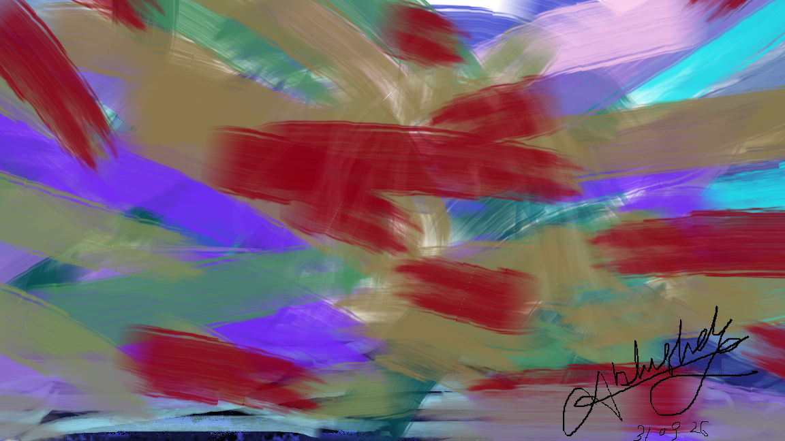

# abstract-art-distorted-fragmentation
An abstract digital art piece exploring psychological abstraction, hidden identities and fragmented presence, created using MS Paint.
# Distorted Fragmentation

**Distorted Fragmentation** is an abstract digital art piece created using **MS Paint**.

This work explores **psychological abstraction**, **hidden identities**, **fragmented presence** and **layered emotional tension**.  
It is intentionally open to interpretation, with a subtle **steganographic feel** for those who look beneath the visible surface.

## Tool
MS Paint

## Artwork Preview

## Concept
This piece reflects an inner state shaped by distortion, fragmentation and concealed forms.  
Rather than presenting a fixed figure, it leaves space for the viewer to discover hidden presence and personal meaning within the layers.

## Artist Note
Sometimes even the simplest tool can carry complex emotion.
